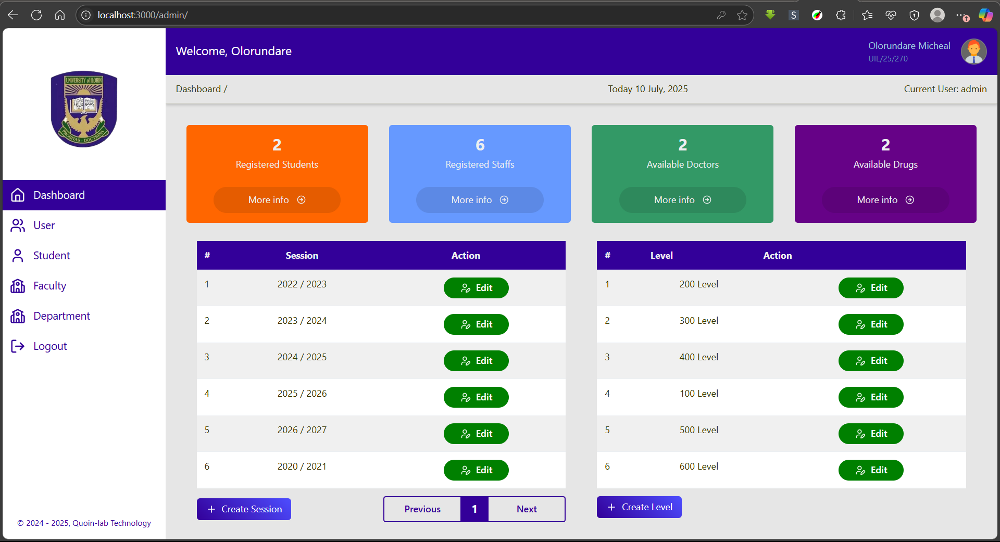
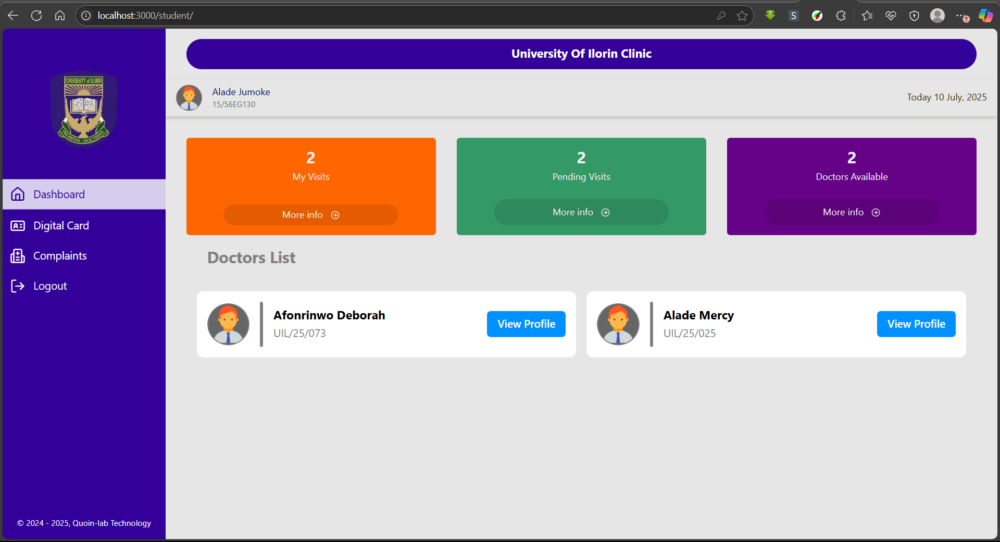

# University of Ilorin Clinic Management System (Frontend)

## Overview

The University of Ilorin Clinic Management System (Frontend) is a web application built with Reflex (formerly Pynecone) to provide an intuitive interface for students and staff to interact with the clinic management system. It features a responsive home page, role-specific dashboards, and pages for news and about the developer company. The frontend connects to a FastAPI backend to manage healthcare services, including appointment booking, digital clinic cards, and health record management.

## Features

### Home Page:
- Navbar with University of Ilorin logo, name, and navigation buttons (Home, News, About Us).
- Title: “CLINIC MANAGEMENT SYSTEM”.
- Introductory text: “Welcome to the University of Ilorin Clinic Management System, your one-stop platform for seamless healthcare services. Easily book appointments, access digital clinic cards, and manage health records as a student or staff member.”
- Buttons for Staff Login and Student Login.

### User Roles:
- **Student**: Register, view digital clinic card (with QR code), book appointments, submit complaints, and manage profile.
- **Doctor**: View schedules, visits, complaints, add diagnoses/prescriptions and give treatments.
- **Pharmacist**: View student visits by matriculation number and dispense drugs.
- **Lab Attendant**: Record and view student health records.
- **Admin**: Create users, academic data, and manage the system via a dedicated dashboard.

### Other Pages:
- **News**: Displays clinic updates, health tips, and announcements.
- **About Us**: Details about the developer company (Quoin-lab Technologies).

### Digital Clinic Card:
- Students can view their clinic card with a QR code encoding their clinic_number.

### Dashboards:
- Role-specific dashboards for students, doctors, pharmacists, lab attendants, and admins.

### Responsive Design:
- Built with Reflex’s component-based architecture, styled with custom CSS or Tailwind CSS.

## Project Structure
```
Clinic/
├── assets/
│ └── clinic_bg.jpg
│ └── school_logo.png
│ └── staff_bg.jpg
│ └── user_pics.png
├── Clinic/
│ ├── components/
│ │ ├── admin_side_bar.py
│ │ ├── doctor_side_bar.py
│ │ ├── footer.py
│ │ ├── lab_side_bar.py
│ │ ├── navbar.py
│ │ ├── pharm_side_bar.py
│ │ ├── sign_up.py
│ │ ├── signin.py
│ │ ├── staff_signin.py
│ │ ├── student_side_bar.py
│ ├── pages/
│ │ ├── admin_dashboard.py
│ │ ├── admin_department.py
│ │ ├── admin_faculty.py
│ │ ├── admin_page.py
│ │ ├── admin_student.py
│ │ ├── admin_user.py
│ │ ├── digital_card.py
│ │ ├── doctor_availability.py
│ │ ├── doctor_dashboard.py
│ │ ├── doctor_schedule.py
│ │ ├── doctor_visit.py
│ │ ├── doctor_page.py
│ │ ├── index_page.py
│ │ ├── lab_attendance_page.py
│ │ ├── lab_dashboard.py
│ │ ├── lab_test.py
│ │ ├── pharmercist_page.py
│ │ ├── pharmercist_dashboard.py
│ │ ├── pharmercist_dispensation.py
│ │ ├── pharmercist_drugs.py
│ │ ├── students_complaints.py
│ │ ├── students_dashboard.py
│ │ ├── students_page.py
│ │ ├── super_signup.py
│ ├── services/
│ │ ├── server_requests.py
│ ├── states/
│ │ ├── admin_department_state.py
│ │ ├── admin_faculty_state.py
│ │ ├── admin_state.py
│ │ ├── admin_student_state.py
│ │ ├── auth_state.py
│ │ ├── auth_student.py
│ │ ├── card_state.py
│ │ ├── dispensation_state.py
│ │ ├── doctor_availability_state.py
│ │ ├── doctor_schedule_state.py
│ │ ├── doctor_state.py
│ │ ├── doctor_visit_state.py
│ │ ├── lab_attendance_state.py
│ │ ├── pharmercist_state.py
│ │ ├── pharmercy_drug_state.py
│ │ ├── student_complaint_state.py
│ │ ├── student_state.py
│ ├── Clinic.py
├── rxconfig.py
├── requirements.txt
```
## Technologies

- **Framework**: Reflex (Python-based web framework)
- **Styling**: Custom CSS or Tailwind CSS (optional, via CDN)
- **Backend API**: FastAPI (running at `http://127.0.0.1:8008`)
- **Dependencies**: reflex, requests (for API calls)

## Screenshots 📸

Get a glimpse of the system!

| Admin Dashboard | Student Dashboard |
| :---------------------------------: | :---------------------------------: |
|  |  |

| Decryption Screen | About Screen |
| :---------------------------------: | :---------------------------------: |
|  |  |


## Setup Instructions

1. **Clone the Repository**:
    ```bash
    git clone https://github.com/Evayoung/Reflex_clinic_Management_system.git 
    cd Reflex_clinic_Management_system
    ```

2. **Install Dependencies**:
    ```bash
    pip install -r requirements.txt
    ```

3. **Set Up Reflex**:
    ```bash
    reflex init
    ```

4. **Configure Reflex**:
    - Ensure `rxconfig.py` is configured with the correct app name (`Clinic`).

5. **Add Logo**:
    - Place the University of Ilorin logo (`school_logo.png`) in `assets/`.

6. **Run the Application**:
    ```bash
    reflex run
    ```
    - Frontend will be available at `http://localhost:3000`.

7. **Connect to Backend**:
    - Ensure the backend is running at `http://127.0.0.1:8008`.
    - Update API endpoints in `clinic_management.py` if the backend URL differs.

## Usage

- **Home Page**: Navigate to `/` to see the landing page with login options.
- **Login**:
  - **Staff**: Use `/staff-login` to authenticate via POST `/auth/user/login`.
  - **Student**: Use `/student-login` to authenticate via POST `/auth/student/login`.

- **Dashboards**:
  - After login, users are redirected to role-specific dashboards (e.g., `/student/dashboard`, `/doctor/dashboard`).

- **News**: View updates at `/news`.
- **About Us**: Learn about the developer at `/about`.
- **Digital Clinic Card**:
  - Students can view their card and QR code at `/student/digital-card` (fetches GET `/students/me/digital-card` and GET `/students/me/digital-card/qr`).

## Testing

### Sample Users:
- **Staff**: `user_id`: `UIL/25/0432`, `password` (set in backend).
- **Student**: `matriculation_number`: `19/56EG120`, `password` (set in backend).

### Test Navigation:
- Verify navbar links (Home, News, About Us).

### Test Login Forms and Dashboard Redirects:
- Test login forms and ensure they redirect to the appropriate dashboards.

### Test QR Code:
- Scan the student’s digital card QR code to verify it encodes the `clinic_number`.

## Contributing

1. Fork the repository.
2. Create a feature branch (`git checkout -b feature/new-feature`).
3. Commit changes (`git commit -m "Add new feature"`).
4. Push to the branch (`git push origin feature/new-feature`).
5. Open a pull request.

## License

[MIT License](LICENSE). See `LICENSE` for details.
